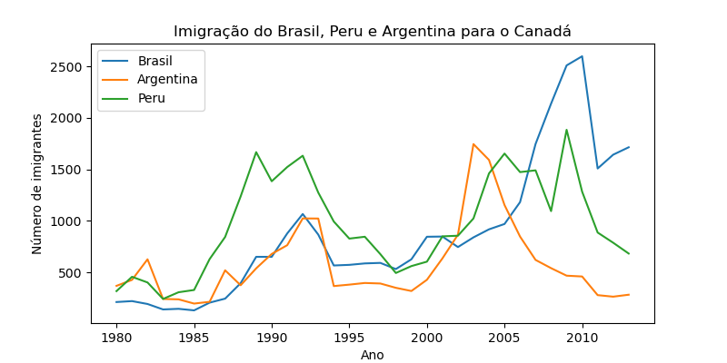

# DataAnalysis
## BasicDataExplorationWithPandas
* Em BasicDataExplorationWithPandas tenho um código que lê os arquivos de um .csv e explora determinadas funcionalizades de um dataFrame e plota um ploxplot usando seaborn
para a comparação de dois aspectos dos dados obtidos via Kangle 
  
## Análise das populações imigrantes no canadá
* No arquivo canada_analysis.ipynb importo dados para comparar os dados de imigração de brasileiros com outros imigrantes da américa latina
  
  
